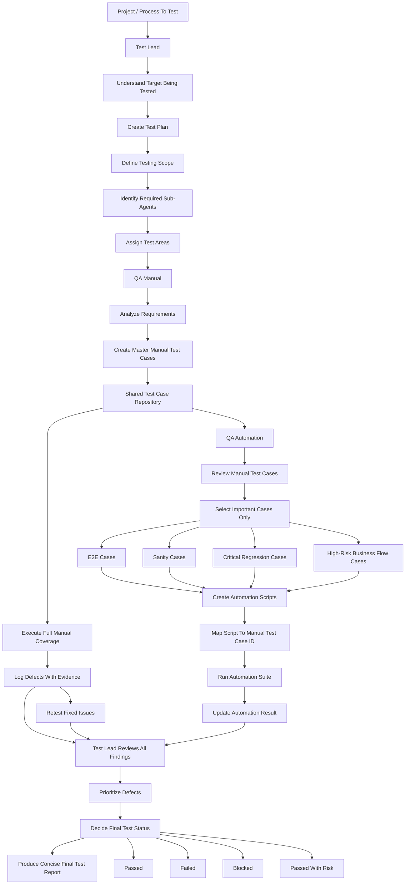

# Test Team Workflow

## Mermaid Workflow



## Team Principle

```text
Manual covers broad testing.
Automation covers important repeatable confidence checks.
Test Lead controls scope, priority, and final quality decision.
```

