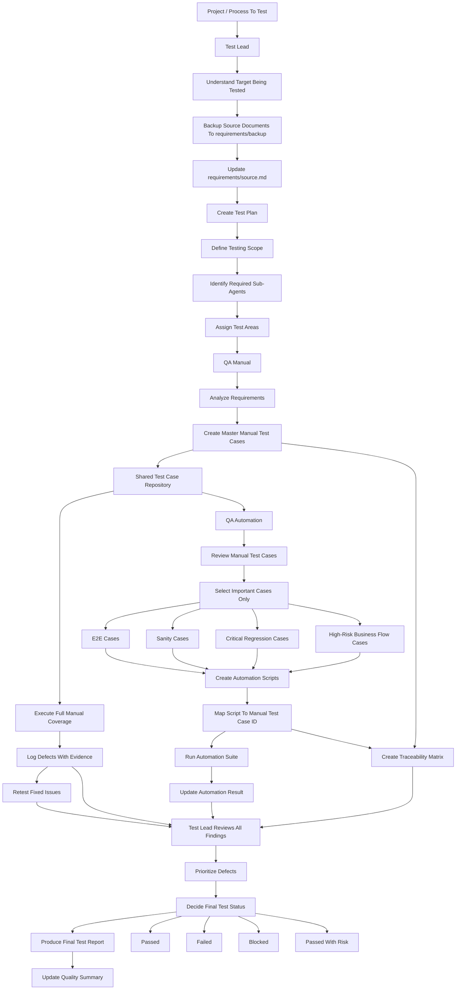

# Test Team Workflow

## Mermaid Workflow



## Team Principle

```text
Manual covers broad testing.
Automation covers important repeatable confidence checks.
Test Lead controls scope, priority, and final quality decision.
```

## Updated Project Process

```text
Set 1: Project Setup And Test Planning
1. Create / copy project folder.
2. Backup requirement/source files.
3. Update requirements/source.md.
4. Test Lead kickoff.
5. Create / update test plan.

Set 2: Test Design And Automation Preparation
6. QA Manual creates master test cases.
7. QA Manual marks automation candidates.
8. QA Automation selects E2E / sanity / regression cases.
9. Fill e2e-cases.md, sanity-cases.md, regression-cases.md.
10. Create automation mapping.
11. Create automation scripts.
12. Create traceability matrix.

Set 3: Test Execution
13. Initialize manual-run-001.md.
14. Execute automation run.
15. Execute Full Manual Coverage.
16. Log defects if found.

Set 4: Defect Fix, Retest, And Quality Update
17. Retest if needed.
18. Update quality summary.

Set 5: Final Report And Test Lead Decision
19. Create final test report.
20. Test Lead decides final status.
```

## Set Control Rules

```text
- Do not move to Set 2 until Set 1 is reviewed and approved.
- Do not move to Set 3 until Set 2 is reviewed and complete.
- Do not move to Set 5 until execution is complete.
- If defects exist, Set 4 must run before Set 5.
- Step 17 runs only when defects exist.
- If no defects exist, skip retest and update quality summary directly.
- If defects exist, repeat fix -> retest until resolved or accepted as risk by Test Lead.
```

## Required Project Evidence

```text
requirements/backup/README.md
requirements/source.md
requirements/review-notes.md
documents/test-plan.md
test-cases/master-test-cases.md
automation/mapping.md
test-runs/manual-run-001.md
test-runs/automation-run-001.md
defects/open-defects.md
reports/traceability-matrix.md
reports/quality-summary.md
reports/final-test-report.md
```

## Evidence By Set

```text
Set 1 outputs:
- requirements/backup/
- requirements/source.md
- reports/test-lead-kickoff.md
- documents/test-plan.md

Set 2 outputs:
- test-cases/master-test-cases.md
- test-cases/e2e-cases.md
- test-cases/sanity-cases.md
- test-cases/regression-cases.md
- automation/mapping.md
- automation/scripts/
- reports/traceability-matrix.md

Set 3 outputs:
- test-runs/manual-run-001.md
- test-runs/automation-run-001.md
- defects/open-defects.md if defects are found

Set 4 outputs:
- defects/open-defects.md
- defects/closed-defects.md
- test-runs/manual-run-002.md if needed
- test-runs/automation-run-002.md if needed
- reports/quality-summary.md

Set 5 outputs:
- reports/final-test-report.md
- reports/quality-summary.md
```
